<!-- ============================================================
     Milan Kumar Behera — GitHub Profile
     Theme: "Signal" — matches milanbeherazyx.github.io
     Palette: bg #0b0c10 · indigo #6366f1→violet #a855f7 · cyan #22d3ee
     ============================================================ -->

<div align="center">

<!-- ── HERO (custom animated SVG — built in Phase 2) ────────── -->
<picture>
  <source media="(prefers-color-scheme: light)" srcset="assets/hero-light.svg">
  
</picture>

<!-- ── TYPING LINE ──────────────────────────────────────────── -->
<picture>
  <source media="(prefers-color-scheme: light)" srcset="https://readme-typing-svg.demolab.com/?font=JetBrains+Mono&weight=600&size=19&duration=2600&pause=900&color=0E7490&center=true&vCenter=true&width=760&height=42&lines=Funnels+%C2%B7+Metrics+%C2%B7+Root+causes+%C2%B7+Dashboards;Qualification+lifted+30%25+%E2%86%92+43%25+across+6+lenders;%E2%82%B98%E2%80%939B%2B+loan+book+monitored+%C2%B7+100K%2B+active+loans;SQL+%C2%B7+Python+%C2%B7+Snowflake+%C2%B7+Tableau+%C2%B7+Power+BI">
  
</picture>

<br><br>

<!-- ── PROOF METRICS (custom animated SVG — built in Phase 3) ─ -->
<picture>
  <source media="(prefers-color-scheme: light)" srcset="assets/metrics-light.svg">
  
</picture>

</div>

<!-- ── ABOUT / CURRENTLY ────────────────────────────────────── -->
## `$ whoami`

Data analyst with **4+ years in lending & credit risk**. I turn messy operational data into decisions — funnels, metric definitions, root causes, dashboards. The domain changes; **the method doesn't.**

```yaml
now:      Business Analyst — BRE @ Khatabook, Bengaluru
scope:    6 lending partners · 112 decision rules → 200+ policy variants · 119 variables
book:     ₹8–9B+ exposure monitored · 100K–125K monthly borrowers · 15+ DPD stages
before:   Quinte FinTech (Axos Bank, USA) · Omdena (60+ member data team lead) · founder @ The Oven Vibe
open_to:  freelance_leads & full-time_roles
```

<!-- ── FEATURED WORK ────────────────────────────────────────── -->
## `$ featured --work`

| Case study | Impact | What it was |
| :--- | :--- | :--- |
| **[Lifting portfolio qualification from 30% → 43%](https://milanbeherazyx.github.io/work/lifting-qualification-30-to-43/)** | `+13 pts` | Approval-funnel & rejection-code analytics across 6 lending partners, 100K+ monthly borrowers |
| **[Policy as code: 112 rules, 200+ variants](https://milanbeherazyx.github.io/work/policy-as-code/)** | `6 lenders` | Credit policy managed like source code — versioned, benchmarked, UAT-replayed before deploy |
| **[Cohort & vintage delinquency for a US bank](https://milanbeherazyx.github.io/work/cohort-vintage-delinquency/)** | `+25–30% accuracy` | Vintage-curve monitoring for Axos Bank; regulatory reporting time cut by 50% |
| **[Killing 80% of manual vendor risk reviews](https://milanbeherazyx.github.io/work/killing-manual-vendor-reviews/)** | `−80% manual work` | Python + REST API ETL pipeline; audit scores +15%, risk incidents −20% |

<div align="center">

**[→ all case studies](https://milanbeherazyx.github.io/work/)** · **[→ services](https://milanbeherazyx.github.io/services/)**

</div>

<!-- ── TECH STACK ───────────────────────────────────────────── -->
## `$ stack --list`

**Languages & BI**


**Platforms & Tools**


**Analytics craft**

`BRE policy logic` · `Funnel analysis` · `A/B testing` · `Risk cohort analysis` · `EWI tracking` · `Root-cause analysis` · `Machine learning` · `REST API integration` · `UAT & sanity checks`

<!-- ── EXPERIENCE SNAPSHOT ──────────────────────────────────── -->
## `$ history --career`

| When | Where | What |
| :--- | :--- | :--- |
| `2026 →` | **Khatabook** — Business Analyst, BRE | BRE analytics across 6 lending partners; qualification 30% → 43% |
| `2025 →` | **The Oven Vibe** — Founder | D2C bakery run on SKU-level margin analytics |
| `2024–25` | **Quinte Financial Technologies** — Data / GRC Analyst | Cohort & vintage delinquency for Axos Bank (USA); vendor-risk automation |
| `2023–24` | **Omdena** — Data Team Lead / ML Engineer | Led 60+ member global data team; ML for cities on 3 continents |
| `2019–22` | **Chaitanya Projects** — Data Analyst | Regression models cut cement consumption 35%, project delays 10% |

<!-- ── GITHUB STATS ─────────────────────────────────────────── -->
## `$ stats --live`

<div align="center">

<!-- Self-hosted stat cards, regenerated daily from the GitHub API by
     .github/workflows/stats.yml — no third-party service to go down. -->
<picture>
  <source media="(prefers-color-scheme: light)" srcset="assets/stats-light.svg">
  
</picture>
<picture>
  <source media="(prefers-color-scheme: light)" srcset="assets/langs-light.svg">
  
</picture>

<picture>
  <source media="(prefers-color-scheme: light)" srcset="assets/streak-light.svg">
  
</picture>

<picture>
  <source media="(prefers-color-scheme: light)" srcset="https://github-readme-activity-graph.vercel.app/graph?username=milanbeherazyx&hide_border=true&bg_color=fafafa&color=4d5361&line=6366f1&point=0e7490&area=true&area_color=6366f1&title_color=4338ca">
  
</picture>

</div>

<!-- ── LATEST BLOG POSTS (auto-updated by Actions — Phase 4) ── -->
## `$ blog --latest`

<!-- BLOG-POST-LIST:START -->
- [A QA checklist for Tableau and Power BI dashboards people actually trust](https://milanbeherazyx.github.io/blog/dashboard-qa-checklist-tableau-power-bi/)
- [Policy as code: how to test credit policy changes before they ship](https://milanbeherazyx.github.io/blog/testing-credit-policy-changes-policy-as-code/)
- [Automating manual review work with Python and a REST API](https://milanbeherazyx.github.io/blog/automating-manual-reviews-python-rest-api/)
- [Diagnosing a funnel drop with rejection-code analysis — a SQL walkthrough](https://milanbeherazyx.github.io/blog/diagnosing-funnel-drops-rejection-code-analysis-sql/)
<!-- BLOG-POST-LIST:END -->

<!-- ── SNAKE (generated by Actions — Phase 4) ───────────────── -->
<div align="center">

<picture>
  <source media="(prefers-color-scheme: light)" srcset="https://raw.githubusercontent.com/milanbeherazyx/milanbeherazyx/output/github-snake.svg">
  
</picture>

</div>

<!-- ── CONNECT ──────────────────────────────────────────────── -->
## `$ connect --now`

<div align="center">

[](https://milanbeherazyx.github.io)
[](https://www.linkedin.com/in/milanbeherazyx/)
[](mailto:milanbeherazyx@gmail.com?subject=Intro%20call)
[](https://milanbeherazyx.github.io/resume.pdf)
[](https://x.com/milanbeherazyx)

<br>

<sub>I read everything myself and reply within a day.</sub>

<br><br>


</div>
